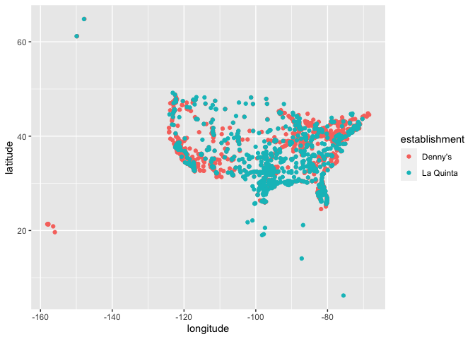
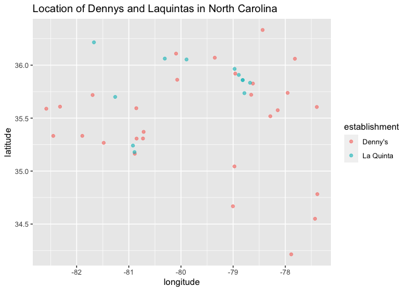
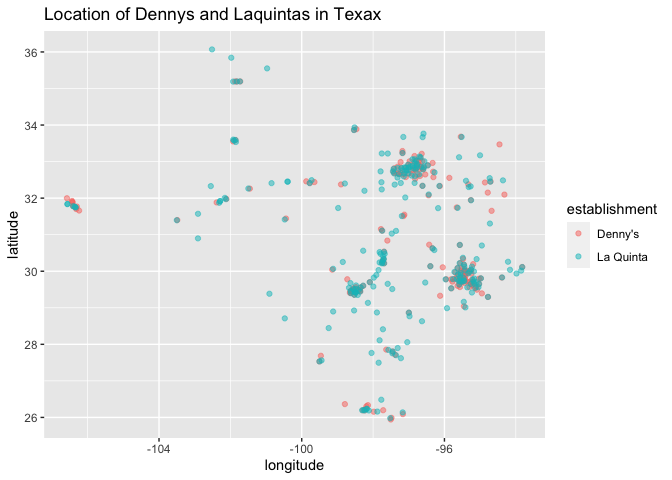

Lab 04 - La Quinta is Spanish for next to Denny’s, Pt. 1
================
Elayna Seago
2/15/22

### Load packages and data

``` r
library(tidyverse) 
library(dsbox) 
```

``` r
states <- read_csv("data/states.csv")
```

### Exercise 1

The variables for the dennys data and laquinta data are address, city,
latitude, longitude, state, and zip

``` r
nrow(dennys)
```

    ## [1] 1643

``` r
ncol(dennys)
```

    ## [1] 6

``` r
ls(dennys)
```

    ## [1] "address"   "city"      "latitude"  "longitude" "state"     "zip"

### Exercise 2

``` r
nrow(laquinta)
```

    ## [1] 909

``` r
ncol(laquinta)
```

    ## [1] 6

``` r
ls(laquinta)
```

    ## [1] "address"   "city"      "latitude"  "longitude" "state"     "zip"

### Exercise 3

For Dennys, no. For laquinta, yes. Canada, Mexico, China, New Zealand,
Honduras, Turkey, UAE, Chile, and Colombia

### Exercise 4

Filter the state data for values of na or other

### Exercise 5

``` r
dennys %>%
  filter(!(state %in% state.abb))
```

    ## # A tibble: 2 × 6
    ##   address                city       state zip   longitude latitude
    ##   <chr>                  <chr>      <chr> <chr>     <dbl>    <dbl>
    ## 1 1250 Bladensburg Rd Ne Washington DC    20002     -77.0     38.9
    ## 2 4445 Benning Rd Ne     Washington DC    20019     -76.9     38.9

### Exercise 6

``` r
dennys %>%
  mutate(country = "United States")
```

    ## # A tibble: 1,643 × 7
    ##    address                        city    state zip   longitude latitude country
    ##    <chr>                          <chr>   <chr> <chr>     <dbl>    <dbl> <chr>  
    ##  1 2900 Denali                    Anchor… AK    99503    -150.      61.2 United…
    ##  2 3850 Debarr Road               Anchor… AK    99508    -150.      61.2 United…
    ##  3 1929 Airport Way               Fairba… AK    99701    -148.      64.8 United…
    ##  4 230 Connector Dr               Auburn  AL    36849     -85.5     32.6 United…
    ##  5 224 Daniel Payne Drive N       Birmin… AL    35207     -86.8     33.6 United…
    ##  6 900 16th St S, Commons on Gree Birmin… AL    35294     -86.8     33.5 United…
    ##  7 5931 Alabama Highway, #157     Cullman AL    35056     -86.9     34.2 United…
    ##  8 2190 Ross Clark Circle         Dothan  AL    36301     -85.4     31.2 United…
    ##  9 900 Tyson Rd                   Hope H… AL    36043     -86.4     32.2 United…
    ## 10 4874 University Drive          Huntsv… AL    35816     -86.7     34.7 United…
    ## # … with 1,633 more rows

### Exercise 7

``` r
laquinta %>%
  filter(!(state %in% state.abb))
```

    ## # A tibble: 14 × 6
    ##    address                     city               state zip   longitude latitude
    ##    <chr>                       <chr>              <chr> <chr>     <dbl>    <dbl>
    ##  1 Carretera Panamericana Sur… "\nAguascalientes" AG    20345    -102.     21.8 
    ##  2 Av. Tulum Mza. 14 S.M. 4 L… "\nCancun"         QR    77500     -86.8    21.2 
    ##  3 Ejercito Nacional 8211      "Col\nPartido Igl… CH    32528    -106.     31.7 
    ##  4 Blvd. Aeropuerto 4001       "Parque Industria… NL    66600    -100.     25.8 
    ##  5 Carrera 38 # 26-13 Avenida… "\nMedellin Colom… ANT   0500…     -75.6     6.22
    ##  6 AV. PINO SUAREZ No. 1001    "Col. Centro\nMon… NL    64000    -100.     25.7 
    ##  7 Av. Fidel Velazquez #3000 … "\nMonterrey"      NL    64190    -100.     25.7 
    ##  8 63 King Street East         "\nOshawa"         ON    L1H1…     -78.9    43.9 
    ##  9 Calle Las Torres-1 Colonia… "\nPoza Rica"      VE    93210     -97.4    20.6 
    ## 10 Blvd. Audi N. 3 Ciudad Mod… "\nSan Jose Chiap… PU    75010     -97.8    19.2 
    ## 11 Ave. Zeta del Cochero No 4… "Col. ReservaTerr… PU    72810     -98.2    19.0 
    ## 12 Av. Benito Juarez 1230 B (… "\nSan Luis Potos… SL    78399    -101.     22.1 
    ## 13 Blvd. Fuerza Armadas        "contiguo Mall La… FM    11101     -87.2    14.1 
    ## 14 8640 Alexandra Rd           "\nRichmond"       BC    V6X1…    -123.     49.2

### Exercise 8

``` r
laquinta %>%
  mutate(country = case_when(
    state %in% state.abb     ~ "United States",
    state %in% c("ON", "BC") ~ "Canada",
    state == "ANT"           ~ "Colombia",
    state %in% c("AG" , "QR" , "CH" , "NL" , "VE" , "PU" , "SL" ) ~ "Mexico",
    state == "FM" ~"Honduras"
  )) %>% 
  filter(country == "United States")
```

    ## # A tibble: 895 × 7
    ##    address                         city   state zip   longitude latitude country
    ##    <chr>                           <chr>  <chr> <chr>     <dbl>    <dbl> <chr>  
    ##  1 793 W. Bel Air Avenue           "\nAb… MD    21001     -76.2     39.5 United…
    ##  2 3018 CatClaw Dr                 "\nAb… TX    79606     -99.8     32.4 United…
    ##  3 3501 West Lake Rd               "\nAb… TX    79601     -99.7     32.5 United…
    ##  4 184 North Point Way             "\nAc… GA    30102     -84.7     34.1 United…
    ##  5 2828 East Arlington Street      "\nAd… OK    74820     -96.6     34.8 United…
    ##  6 14925 Landmark Blvd             "\nAd… TX    75254     -96.8     33.0 United…
    ##  7 909 East Frontage Rd            "\nAl… TX    78516     -98.1     26.2 United…
    ##  8 2116 Yale Blvd Southeast        "\nAl… NM    87106    -107.      35.1 United…
    ##  9 7439 Pan American Fwy Northeast "\nAl… NM    87109    -107.      35.2 United…
    ## 10 2011 Menaul Blvd Northeast      "\nAl… NM    87107    -107.      35.1 United…
    ## # … with 885 more rows

### Exercise 9

Texas has the most Dennys and Delaware has the least Dennys. Texas has
the most laquintas and Maine has the least. This is not surprising.
Texas is huge and has lots of people while Maine and Delaware are small
with relatively low populations.

``` r
dennys %>% 
  count(state) %>% 
  arrange(desc(n))
```

    ## # A tibble: 51 × 2
    ##    state     n
    ##    <chr> <int>
    ##  1 CA      403
    ##  2 TX      200
    ##  3 FL      140
    ##  4 AZ       83
    ##  5 IL       56
    ##  6 NY       56
    ##  7 WA       49
    ##  8 OH       44
    ##  9 MO       42
    ## 10 PA       40
    ## # … with 41 more rows

``` r
dennys %>% 
  count(state) %>% 
  arrange(n)
```

    ## # A tibble: 51 × 2
    ##    state     n
    ##    <chr> <int>
    ##  1 DE        1
    ##  2 DC        2
    ##  3 VT        2
    ##  4 AK        3
    ##  5 IA        3
    ##  6 NH        3
    ##  7 SD        3
    ##  8 WV        3
    ##  9 LA        4
    ## 10 MT        4
    ## # … with 41 more rows

``` r
laquinta %>%
  mutate(country = case_when(
    state %in% state.abb     ~ "United States",
    state %in% c("ON", "BC") ~ "Canada",
    state == "ANT"           ~ "Colombia",
    state %in% c("AG" , "QR" , "CH" , "NL" , "VE" , "PU" , "SL" ) ~ "Mexico",
    state == "FM" ~"Honduras"
  )) %>% 
  filter(country == "United States") %>% 
    count(state) %>% 
  arrange(desc(n))
```

    ## # A tibble: 48 × 2
    ##    state     n
    ##    <chr> <int>
    ##  1 TX      237
    ##  2 FL       74
    ##  3 CA       56
    ##  4 GA       41
    ##  5 TN       30
    ##  6 OK       29
    ##  7 LA       28
    ##  8 CO       27
    ##  9 NM       19
    ## 10 NY       19
    ## # … with 38 more rows

``` r
laquinta %>%
  mutate(country = case_when(
    state %in% state.abb     ~ "United States",
    state %in% c("ON", "BC") ~ "Canada",
    state == "ANT"           ~ "Colombia",
    state %in% c("AG" , "QR" , "CH" , "NL" , "VE" , "PU" , "SL" ) ~ "Mexico",
    state == "FM" ~"Honduras"
  )) %>% 
  filter(country == "United States") %>% 
    count(state) %>% 
  arrange(n)
```

    ## # A tibble: 48 × 2
    ##    state     n
    ##    <chr> <int>
    ##  1 ME        1
    ##  2 AK        2
    ##  3 NH        2
    ##  4 RI        2
    ##  5 SD        2
    ##  6 VT        2
    ##  7 WV        3
    ##  8 WY        3
    ##  9 IA        4
    ## 10 MI        4
    ## # … with 38 more rows

``` r
dennys %>%
  count(state) %>%
  inner_join(states, by = c("state" = "abbreviation"))
```

    ## # A tibble: 51 × 4
    ##    state     n name                     area
    ##    <chr> <int> <chr>                   <dbl>
    ##  1 AK        3 Alaska               665384. 
    ##  2 AL        7 Alabama               52420. 
    ##  3 AR        9 Arkansas              53179. 
    ##  4 AZ       83 Arizona              113990. 
    ##  5 CA      403 California           163695. 
    ##  6 CO       29 Colorado             104094. 
    ##  7 CT       12 Connecticut            5543. 
    ##  8 DC        2 District of Columbia     68.3
    ##  9 DE        1 Delaware               2489. 
    ## 10 FL      140 Florida               65758. 
    ## # … with 41 more rows

``` r
laquinta %>%
  count(state) %>%
  inner_join(states, by = c("state" = "abbreviation"))
```

    ## # A tibble: 48 × 4
    ##    state     n name           area
    ##    <chr> <int> <chr>         <dbl>
    ##  1 AK        2 Alaska      665384.
    ##  2 AL       16 Alabama      52420.
    ##  3 AR       13 Arkansas     53179.
    ##  4 AZ       18 Arizona     113990.
    ##  5 CA       56 California  163695.
    ##  6 CO       27 Colorado    104094.
    ##  7 CT        6 Connecticut   5543.
    ##  8 FL       74 Florida      65758.
    ##  9 GA       41 Georgia      59425.
    ## 10 IA        4 Iowa         56273.
    ## # … with 38 more rows

###Exercise 10

``` r
dennys <- dennys %>%
  mutate(establishment = "Denny's")
laquinta <- laquinta %>%
  mutate(establishment = "La Quinta")

dn_lq <- bind_rows(dennys, laquinta)
```

``` r
ggplot(dn_lq, mapping = aes(x = longitude, y = latitude, color = establishment)) +
  geom_point()
```

<!-- -->

###Exercise 11 His joke does not seem to be particularly accurate in NC.

``` r
dn_lq %>% 
  filter(state == "NC") %>% 
  ggplot(dn_lq, mapping = aes(x = longitude, y = latitude, color = establishment)) +
  geom_point(alpha = .6)+
  labs(
    title = "Location of Dennys and Laquintas in North Carolina"
  )
```

<!-- -->

###Exercise 11 His joke is pretty accurate in Texas

``` r
dn_lq %>% 
  filter(state == "TX") %>% 
  ggplot(dn_lq, mapping = aes(x = longitude, y = latitude, color = establishment)) +
  geom_point(alpha = .5)+
  labs(
    title = "Location of Dennys and Laquintas in Texax"
  )
```

<!-- -->

Add exercise headings as needed.
